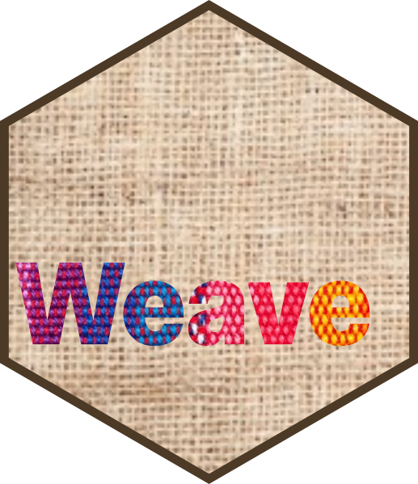

<!-- README.md is generated from README.Rmd. Please edit that file -->

```{r, include = FALSE}
knitr::opts_chunk$set(
  collapse = TRUE,
  comment = "#>",
  fig.path = "man/figures/README-",
  out.width = "100%"
)
```

# weave 

<!-- badges: start -->
[](https://github.com/mrc-ide/weave/actions/workflows/R-CMD-check.yaml)
[](https://app.codecov.io/gh/mrc-ide/weave)
<!-- badges: end -->

## Installation

You can install the development version of weave from [GitHub](https://github.com/) with:

``` r
# install.packages("pak")
pak::pak("mrc-ide/weave")
```

