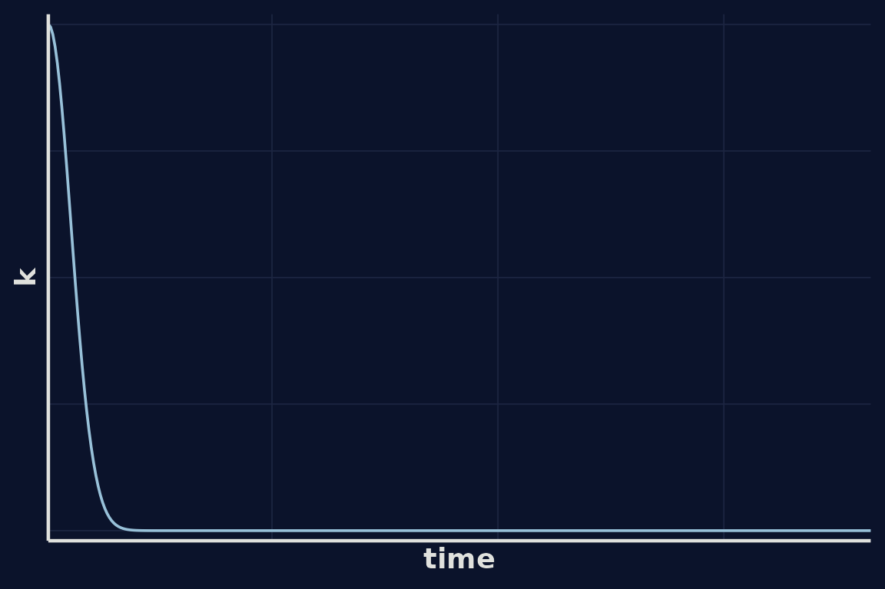
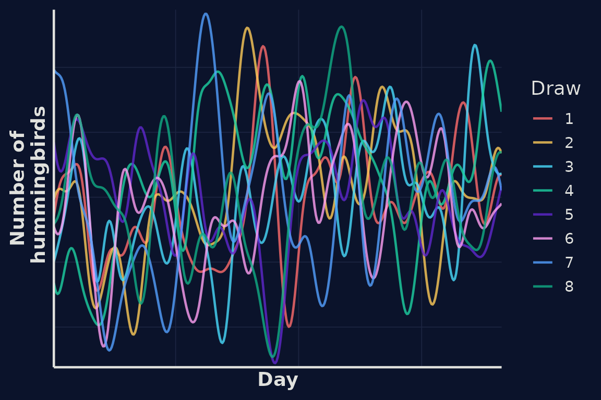
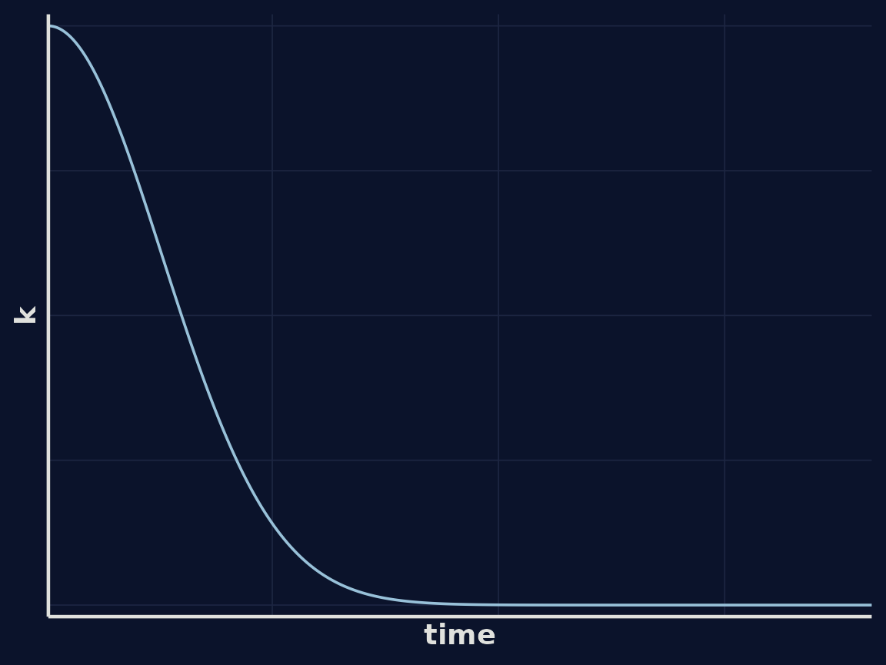
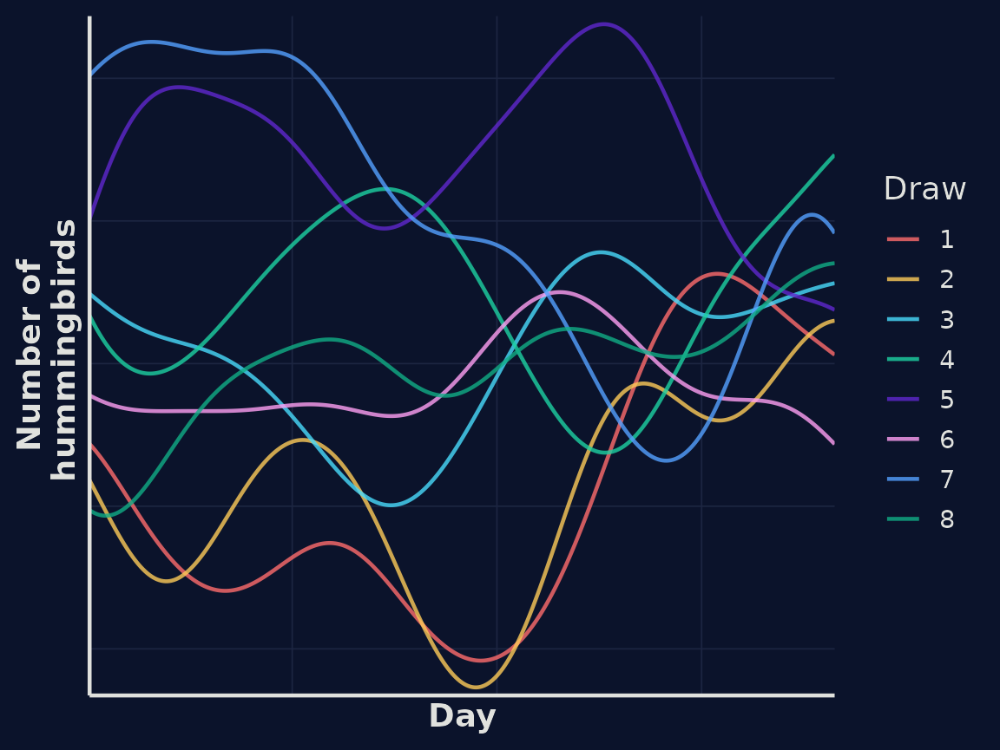

# Gaussian Processes: a Gentle Introduction

``` r

library(weave)
```

## 1. Why Gaussian Processes?

**Motivation and story**  
Many real-world phenomena change smoothly but unpredictably — rainfall
over time, temperature, the number of birds visiting a feeder, or
website traffic.

**Problem framing**  
We often want to *infer the underlying pattern* from sparse, noisy
observations **without** imposing a fixed parametric form. As much as
possible, we want to let the data shape the result.

**Enter Gaussian Processes**  
A Gaussian process (GP) is a flexible, probabilistic approach to
modelling unknown functions. It lets us predict *and* quantify
uncertainty — not just what the function might be, but how confident we
are.

## 2. What is a Gaussian Process?

### Plain-language explanation

A **Gaussian process (GP)** is a probability distribution **over
functions**, in the same way that a normal distribution is a probability
distribution **over numbers**.

Just as a normal distribution says, “a random variable is likely to take
values near the mean, with some spread determined by the variance”, a
Gaussian process says, “a random function is likely to take *shapes*
near the mean function, with variability determined by the kernel”.

### Building intuition

Instead of committing to a fixed equation (like fitting a straight line
or a polynomial), a GP says:  
\> “I don’t know the exact form of the function — but I do have beliefs
about how it behaves.”

Those beliefs are about how points in time relate to one another —
whether nearby points tend to be similar, how far that similarity
extends, and how much uncertainty there is. All of that structure is
encoded in the **kernel function**.

Once we’ve defined a kernel, we can imagine an infinite number of
possible functions that are consistent with it and the GP represents a
probability distribution over all of them.

### Mathematical form

A Gaussian process is defined by a **mean function** $`m(x)`$ and a
**kernel (covariance) function** $`k(x, x')`$.

For simplicity, we often assume the mean function is zero — that is:

``` math
m(x) = 0
```

This assumption is common because the kernel captures the interesting
structure (smoothness, periodicity, etc.), and we can always add a
non-zero mean function later if needed.

With that simplification, we write:

``` math
f(x) \sim \mathcal{GP}\left( 0,\, k(x, x') \right)
```

This means that for any set of input points $`x_1, x_2, \dots, x_n`$,
the corresponding function values follow a multivariate normal
distribution with:

- a zero mean vector, and  
- a covariance matrix with entries $`K_{ij} = k(x_i, x_j)`$.

## 3. A Real Example: Hummingbirds at the Feeder


Hummingbird in flight. Photo By Savannah River Site

To make these ideas more concrete, let’s look at a simple and intuitive
example.

Imagine we’ve set up a hummingbird feeder in our garden, and we want to
model the **number of hummingbirds** visiting over time.  
We don’t have a fixed equation for how that number changes, but we *do*
have some prior beliefs:

- The number of hummingbirds on one day is likely to be similar to the
  number on nearby days.  
- Those similarities weaken as we compare days that are further apart.  
- The visits change smoothly rather than jumping around erratically.

These are exactly the kinds of assumptions a Gaussian process can
represent — and they are encoded in our **kernel**.

------------------------------------------------------------------------

### 3.1 Describing the kernel

We’ll use a **radial basis function (RBF)** kernel, which is one of the
simplest and most widely used choices. It encodes the idea that points
closer together in time are more strongly correlated, and that this
correlation decays smoothly zwith distance.

The RBF kernel is defined as:

``` math
k(x, x') = \sigma^2 \exp\left(-\frac{(x - x')^2}{2\ell^2}\right)
```

- $`\sigma^2`$ controls the overall variability (amplitude) of the
  function.  
- $`\ell`$ is the **length-scale**, which determines how quickly
  correlation falls off with time.

A short length-scale means the number of hummingbirds can change rapidly
from day to day (a “wiggly” world).  
A long length-scale means it changes more gradually (a “smooth” world).

------------------------------------------------------------------------

### 3.2 Visualising the kernel

Let’s look at what the kernel function looks like as a function of
distance in time:



Using this kernel, we can draw some random functions from our GP
representing simulated estimates of the number of hummingbirds at our
feeder over time.



In our first example correlation between hummingbird numbers falls
quickly as the distance between time points increases. We migth assume
that hummingbird numbers vary more slowly, perhaps influenced by
seasonal dynamics. We can encode this assumption by modifying our
kernel.



Using this kernel, we can again draw some random functions from our GP
representing simulated estimates of the number of hummingbirds at our
feeder over time. We can see in this example the lines a smoother.



### 3.3 Fitting to data
