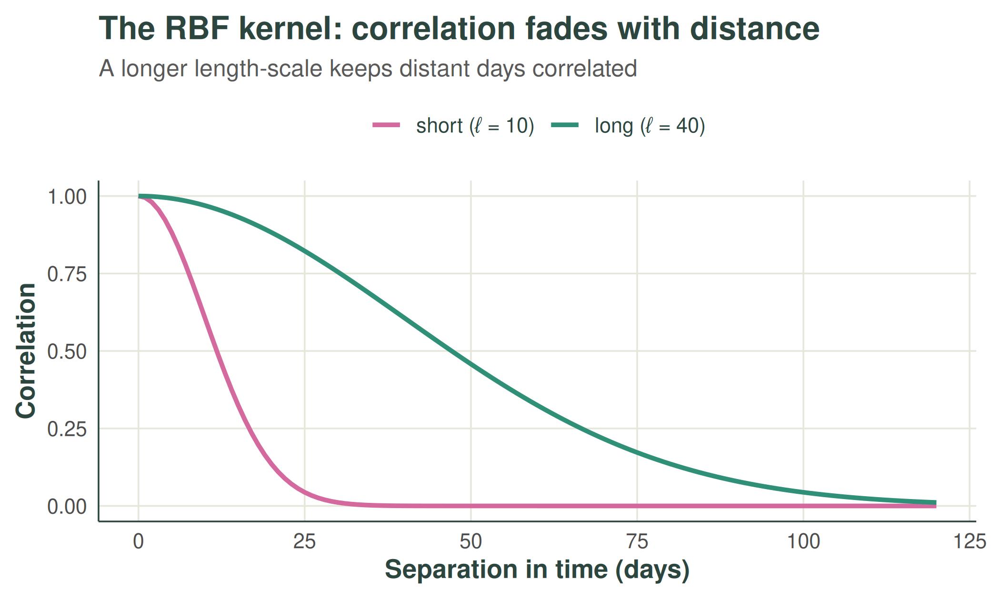
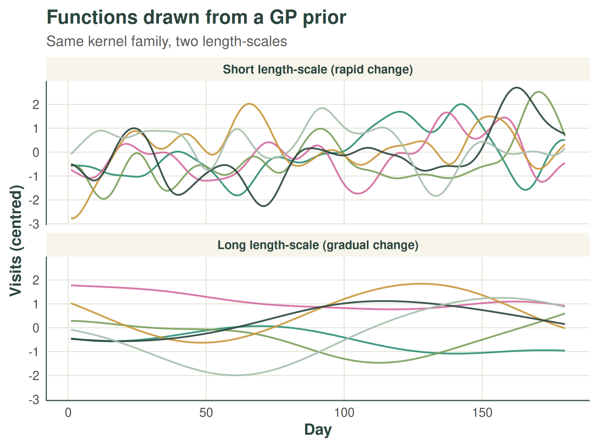
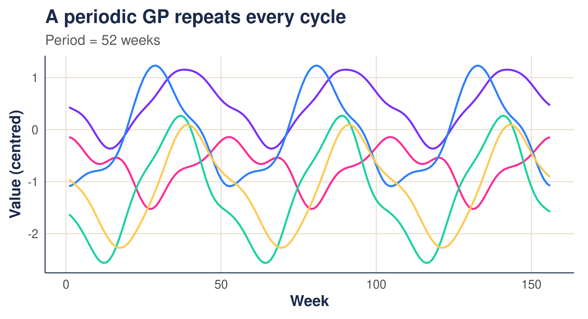
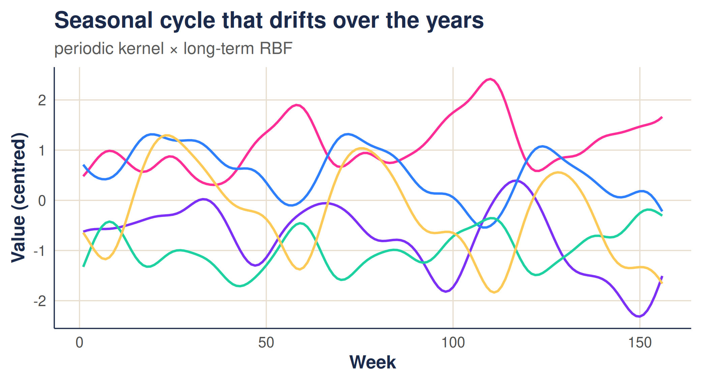
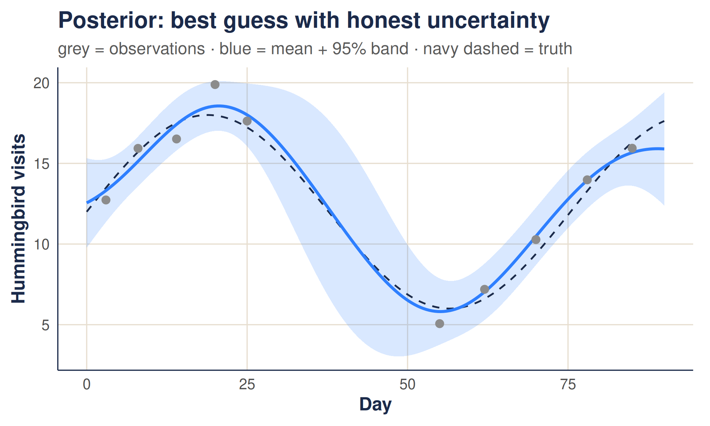

# Gaussian processes: a gentle introduction

``` r

library(weave)
```

This vignette introduces Gaussian processes from the ground up: what
they are, the role of the *kernel*, and how they turn prior beliefs and
a handful of observations into a prediction with honest uncertainty. No
prior exposure is assumed. The companion article, [*The weave
walkthrough*](https://mrc-ide.github.io/weave/articles/walkthrough.md),
then puts these ideas to work on real, gappy surveillance counts.

## 1. Why Gaussian processes?

Many quantities we care about change smoothly, but in ways we cannot
write down in advance: rainfall through the year, temperature, website
traffic, or the number of malaria cases reported by a health facility
from one week to the next. We rarely have a tidy equation for these
patterns — and we usually observe them only sparsely and with noise.

The task, then, is to **infer the underlying pattern from limited,
imperfect observations**, without committing in advance to a fixed shape
such as a straight line or a particular curve. We would also like to
know *how confident* we should be: a single best guess is far less
useful than a guess accompanied by a credible range.

A Gaussian process (GP) meets both needs. It is a flexible,
probabilistic way to model an unknown function that lets the data shape
the result, and it quantifies uncertainty as a natural by-product.

## 2. What is a Gaussian process?

A **Gaussian process** is a probability distribution over *functions*,
in the same way that a normal distribution is a probability distribution
over *numbers*.

A normal distribution says: *a random number is likely to fall near the
mean, with a spread set by the variance.* A Gaussian process says: *a
random function is likely to take shapes near a mean function, with the
variability between nearby points set by the kernel.*

Rather than commit to a fixed equation, a GP encodes *beliefs about how
a function behaves*: whether nearby points tend to be similar, how far
that similarity reaches, and how much the function can vary overall.
Every function consistent with those beliefs is possible; the GP assigns
each a probability.

A Gaussian process is defined by a **mean function** $`m(x)`$ and a
**kernel** (or covariance function) $`k(x, x')`$. For simplicity we
usually take the mean to be zero,

``` math
m(x) = 0,
```

because the kernel captures the structure we care about (smoothness,
periodicity, and so on), and a non-zero mean can always be added later.
We then write

``` math
f(x) \sim \mathcal{GP}\bigl(0,\ k(x, x')\bigr).
```

This says that for *any* finite set of input points $`x_1, \dots, x_n`$,
the function values follow a multivariate normal distribution with a
zero mean vector and a covariance matrix whose entries are
$`K_{ij} = k(x_i, x_j)`$. The kernel is the whole story: it determines
how the value at one point relates to the value at another.

## 3. The kernel: encoding beliefs

To make this concrete, imagine a hummingbird feeder in the garden, and
that we want to model the **number of hummingbirds** visiting over time.


Hummingbird in flight. Photo by Savannah River Site.

We have no equation for how that number changes, but we do hold some
sensible beliefs:

- the count on one day is likely to resemble the count on nearby days;
- that resemblance fades as days grow further apart;
- the count varies gradually rather than erratically.

These are exactly the assumptions a kernel can express.

### 3.1 The RBF kernel and its length-scale

The **radial basis function (RBF)** kernel — also called the squared
exponential — is the most widely used choice. It encodes the idea that
points closer together are more strongly correlated, with the
correlation decaying smoothly with distance:

``` math
k(x, x') = \sigma^2 \exp\!\left(-\frac{(x - x')^2}{2\ell^2}\right).
```

$`\sigma^2`$ sets the overall variability (how far the function ranges
from its mean), while $`\ell`$, the **length-scale**, sets how quickly
the correlation fades with distance. A short length-scale allows the
count to change rapidly from day to day; a long one makes it change only
gradually.

The correlation as a function of separation in time is simply the kernel
evaluated against distance. A longer length-scale keeps points
correlated over a wider gap:



We can now *draw* functions from the GP defined by each kernel. Each
draw is one plausible history of feeder visits consistent with our
beliefs. The package’s
[`quick_mvnorm()`](https://mrc-ide.github.io/weave/reference/quick_mvnorm.md)
samples such a function efficiently, which we use to produce the draws
below.

With a short length-scale the draws are rough and turn over quickly;
with a long one they are smooth and slow:



### 3.2 Periodicity: capturing the seasons

Feeder visits — like malaria cases — often follow a yearly rhythm. The
**periodic kernel** expresses the belief that points one full period
apart are alike, regardless of how much time has passed:

``` math
k(x, x') = \exp\!\left(-\frac{2\,\sin^2\!\bigl(\pi\,|x - x'| / p\bigr)}{\alpha^2}\right),
```

where $`p`$ is the period (say 52 weeks) and $`\alpha`$ controls how
sharply the function rises and falls within each cycle. Draws from a
periodic GP repeat their shape from one cycle to the next:



### 3.3 Combining kernels

Kernels can be combined. Adding them lets several patterns coexist;
*multiplying* them makes one pattern modulate another. `weave` uses a
product in time — a periodic kernel multiplied by a long length-scale
RBF — so the seasonal cycle is present every year but is free to drift
slowly in amplitude and level over the long run. The package’s
[`time_kernel()`](https://mrc-ide.github.io/weave/reference/time_kernel.md)
builds exactly this combination:



In space, `weave` uses an RBF kernel on the distance between sites, so
nearby facilities are expected to behave alike. Space and time are then
combined into a single space-time covariance with a *separable*
structure, $`K_{\text{space}} \otimes K_{\text{time}}`$, which keeps the
model fast — a point the
[walkthrough](https://mrc-ide.github.io/weave/articles/walkthrough.md)
returns to. Three numbers control all of this: the spatial
`length_scale`, the `periodic_scale`, and the `long_term_scale`.
Estimating them from data is the subject of that article.

## 4. From prior to posterior: conditioning on data

So far we have only described *beliefs* — the prior. The power of a GP
is that once we observe some data, we can update those beliefs exactly.
The result is the **posterior**: the distribution over functions that
remain consistent with both our kernel and the observations.

Suppose we observe values $`\mathbf{y}`$ at inputs $`\mathbf{x}`$, each
with independent noise of variance $`\sigma_n^2`$, and we want the
function at new inputs $`\mathbf{x}_*`$. Writing $`K`$ for the kernel
evaluated between observed inputs, $`K_*`$ between new and observed
inputs, and $`K_{**}`$ among the new inputs, the posterior is Gaussian
with

``` math
\text{mean} = K_*\bigl(K + \sigma_n^2 I\bigr)^{-1}\mathbf{y}, \qquad
\text{cov}  = K_{**} - K_*\bigl(K + \sigma_n^2 I\bigr)^{-1}K_*^{\top}.
```

The posterior mean is the GP’s best guess; the posterior variance is its
honesty. Near observations the function is pinned down and the
uncertainty is small; away from them the GP reverts towards the prior
mean and the uncertainty grows. Crucially, the band widens *by itself*
in gaps — we never have to tell it to.

Let us condition on a handful of noisy feeder counts. For this
illustration we treat the counts as continuous measurements and leave
the count-specific machinery to the walkthrough. Note the deliberate gap
in the observations between days 25 and 55.

``` r

# a smooth underlying pattern we pretend not to know
true_fn <- function(x) 12 + 6 * sin(x / 12)

x_obs <- c(3, 8, 14, 20, 25, 55, 62, 70, 78, 85)   # note the gap 25 -> 55
y_obs <- true_fn(x_obs) + rnorm(length(x_obs), sd = 1.2)

x_star <- seq(0, 90, length.out = 200)
ell     <- 12      # length-scale
sigma_n <- 1.2     # observation noise

# RBF kernel between two sets of inputs, via outer-difference distances
rbf <- function(a, b, theta) rbf_kernel(outer(a, b, "-"), theta = theta)

ybar <- mean(y_obs)                                # model the centred data
Kxx  <- rbf(x_obs,  x_obs,  ell) + sigma_n^2 * diag(length(x_obs))
Ksx  <- rbf(x_star, x_obs,  ell)
Kss  <- rbf(x_star, x_star, ell)

Kxx_inv  <- solve(Kxx)
post_mean <- ybar + Ksx %*% Kxx_inv %*% (y_obs - ybar)          # posterior mean
post_var  <- pmax(diag(Kss - Ksx %*% Kxx_inv %*% t(Ksx)), 0)    # posterior variance
post_sd   <- sqrt(post_var)

post <- data.frame(
  x     = x_star,
  mean  = as.vector(post_mean),
  lower = as.vector(post_mean) - 1.96 * post_sd,
  upper = as.vector(post_mean) + 1.96 * post_sd
)
```

The posterior mean threads through the observations, and the 95% band
tightens where data is plentiful and balloons across the gap — an honest
admission that the feeder count there is genuinely uncertain.



This single picture is the essence of the method. Everything in the
walkthrough is a scaled-up version of it: instead of one feeder over
time, we condition on *many* facilities across *both* space and time, we
estimate the kernel’s length-scales from the data rather than fixing
them by hand, and we account for the fact that counts are noisy
integers.

## 5. Where this goes next

With the intuition in place, the
[walkthrough](https://mrc-ide.github.io/weave/articles/walkthrough.md)
shows how `weave`:

1.  **estimates** the three kernel length-scales directly from observed
    counts, by maximising the Gaussian-process marginal likelihood; and
2.  **predicts** the underlying rate at every facility and week —
    filling in missing weeks and attaching a 95% prediction interval —
    with
    [`gp_predict()`](https://mrc-ide.github.io/weave/reference/gp_predict.md).

The same prior-to-posterior logic seen here carries through; the
walkthrough adds the spatial dimension, learns the kernel from data, and
handles counts honestly.
