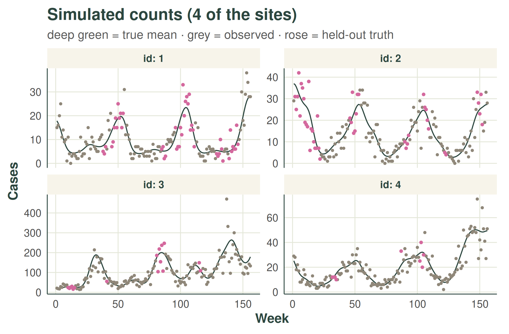
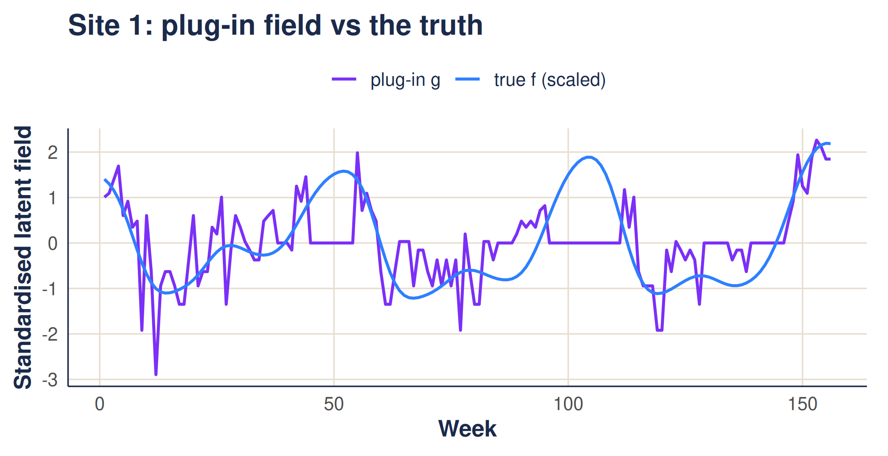
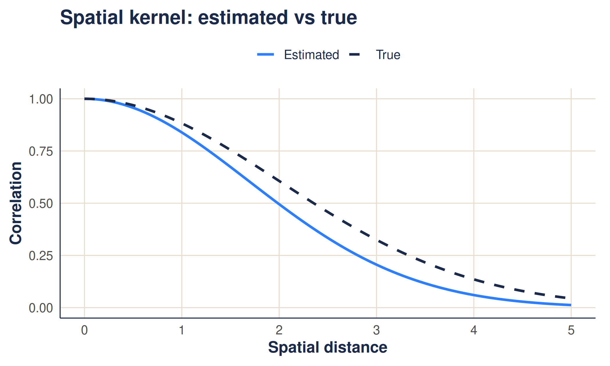
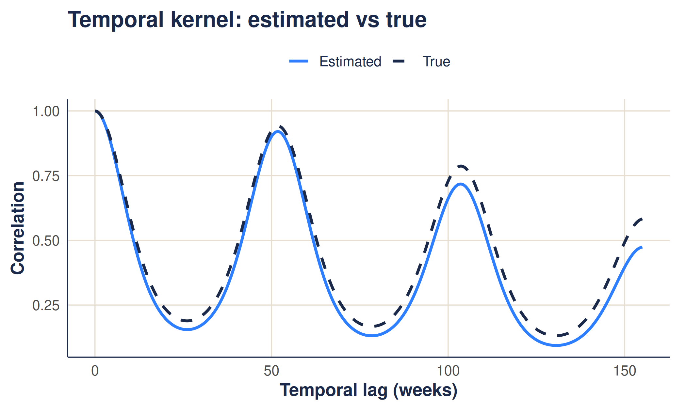
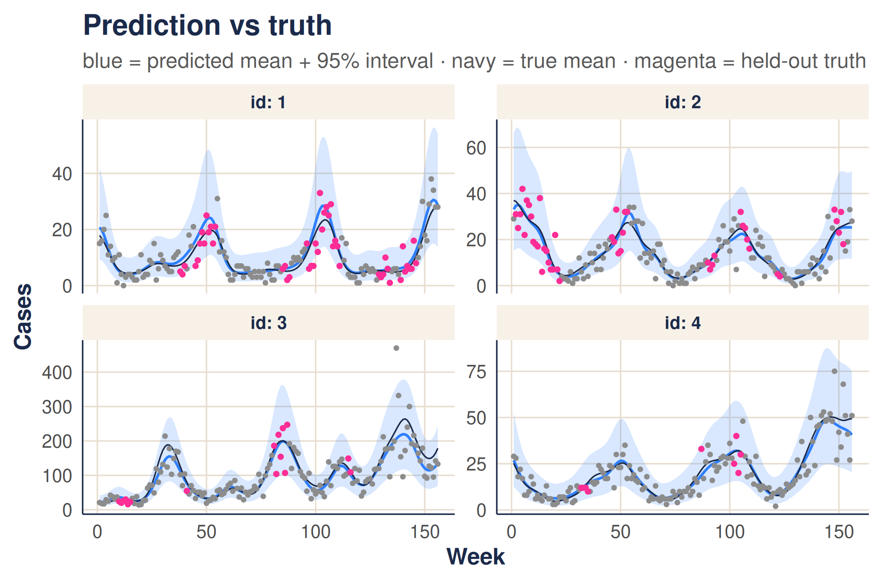

# The weave walkthrough: estimating kernels and predicting rates

``` r

library(weave)
```

This article is a complete walkthrough of how `weave` turns noisy, gappy
count data into a smooth estimate of an underlying rate. If the ideas of
a Gaussian process and a kernel are new, the companion [*gentle
introduction*](https://mrc-ide.github.io/weave/articles/gaussian-processes.md)
builds them up first; here we apply them. The walkthrough has two
halves:

1.  **Estimate the kernel hyperparameters** — the handful of numbers
    that say how quickly counts become uncorrelated as we move apart in
    space and in time.
2.  **Use them to predict** — denoise the observed counts, *fill in the
    missing weeks*, and place an honest **prediction interval** around
    every estimate with
    [`gp_predict()`](https://mrc-ide.github.io/weave/reference/gp_predict.md).

We use a small simulated example with a *known* answer (including known
missing weeks), so we can watch the method recover the truth. At each
stage we give the **maths**, a **plain-language** explanation, and the
**worked example**.

The method is deliberately *quick*: a fast, deterministic estimate
rather than a full Bayesian fit. The approximations that buy that speed
are listed honestly at the end.

## 1. The model

We observe a count `y` at every site `s` (a health facility) and time
`t` (a week), and assume

``` math
y_{st} \sim \text{NegBin}\!\left(r,\ \mu_{st} = e^{\,\mu_s + f_{st}}\right),
\qquad
f \sim \mathcal{N}\!\left(0,\ K_{\text{space}} \otimes K_{\text{time}}\right).
```

- $`\mu_s`$ is a per-site baseline (some facilities are simply busier).
- $`f_{st}`$ is a smooth **latent field** — the part that varies up and
  down in space and time.
- $`K_{\text{space}}`$ and $`K_{\text{time}}`$ are **kernels**: they set
  how correlated two cells are as a function of their separation.
- $`\otimes`$ is the Kronecker product — the full space-time covariance
  is built from a small spatial kernel and a small temporal kernel
  (“separable”).

The kernels carry three hyperparameters — the knobs we want to estimate:

- `length_scale` — how far apart two sites must be before they stop
  looking alike (spatial RBF kernel);
- `periodic_scale` — how sharply the yearly season rises and falls;
- `long_term_scale` — how slowly the year-on-year level drifts.

Each facility has a smooth underlying rate of cases. Nearby facilities,
and nearby weeks, tend to look similar; far-apart ones drift. The three
knobs control *how quickly* that resemblance fades with distance in
space and in time. Our whole task is to read those three numbers off the
data.

### The worked example

We simulate data with *chosen* true knobs, so we can check the answer.
The small helpers that draw the counts and punch clustered gaps into
them (`simulate_data()`, `observed_data()`) are example scaffolding, not
part of the package, so they are hidden here.

``` r

# example dimensions
n      <- 20          # sites (health facilities)
nt     <- 52 * 3      # weeks (3 years)
period <- 52          # weeks per seasonal cycle

# the "true" kernel knobs we will try to recover
true_length_scale    <- 2     # spatial smoothness
true_periodic_scale  <- 1.1   # how sharp the season is
true_long_term_scale <- 150   # long-run drift
true_r               <- 15    # Negative-Binomial dispersion

# site coordinates and per-site baseline log-rate (mu_s)
coordinates <- data.frame(
  id  = factor(1:n),
  lon = runif(n, 0, 5),
  lat = runif(n, 0, 5),
  mu  = log(runif(n, 10, 80))
)

# build the true kernels, draw counts, then hide clustered gaps.
# `obs_data` is all that weave sees: columns id, t, y_obs (NA = missing).
space_k   <- space_kernel(coordinates, length_scale = true_length_scale)
time_k    <- time_kernel(1:nt, periodic_scale = true_periodic_scale,
                         long_term_scale = true_long_term_scale, period = period)
true_data <- simulate_data(n, nt, coordinates, space_k, time_k, r = true_r)
obs_data  <- observed_data(true_data)

cat(sprintf("%.0f%% of weeks are missing\n", 100 * mean(is.na(obs_data$y_obs))))
#> 14% of weeks are missing
```

Here are the first four sites. The **navy line** is the true underlying
mean ($`\lambda = e^{\mu_s + f_{st}}`$); **grey points** are the counts
we actually observe; and **magenta points** are the *held-out truth* at
the weeks that went missing — what the model must reconstruct but never
gets to see.



## 2. Step 1 — a quick “plug-in” latent field

We cannot see the latent field $`f`$ directly, so we build a cheap
stand-in $`g`$ from the counts:

``` math
g_{st} = \frac{\log(1 + y_{st}) - \bar{g}_s}{\text{sd}_s},
```

that is, take $`\log(1+y)`$, then for each site subtract that site’s
mean and divide by its standard deviation.

The logarithm turns the multiplicative “rate” scale into an additive one
that matches $`f`$. Subtracting each site’s average removes the baseline
$`\mu_s`$ (which we do not care about here), and dividing by the spread
puts every site on the same footing, so a single set of knobs applies to
all of them. It is noisy — but it is instant.

### The worked example

``` r

# the plug-in field: per-site centred & scaled log(1 + y), as one long vector
# (length n * nt, with time varying fastest)
g <- build_plugin_field(obs_data, n = n, nt = nt)
str(g)
#>  num [1:3120] 1.008 1.094 1.391 1.692 0.603 ...
```

For one site, the plug-in field tracks the true latent field, just with
observation noise layered on top:



## 3. Step 2 — score a set of knobs with the marginal likelihood

For a candidate set of hyperparameters $`\theta`$ the kernels give a
covariance $`K(\theta)`$. We add a **nugget** — a noise term $`\eta`$ —
and a global variance $`\sigma^2`$:

``` math
g \sim \mathcal{N}\!\Big(0,\ \sigma^2\big[(R_{\text{space}} \otimes R_{\text{time}}) + \eta I\big]\Big),
```

where $`R`$ are *correlation* kernels (unit diagonal). The score for
$`\theta`$ is the log marginal likelihood

``` math
\log p(g \mid \theta) = -\tfrac{1}{2}\Big(\log|K| + g^\top K^{-1} g + N\log 2\pi\Big).
```

We pick the $`\theta`$ that maximises this. The variance $`\sigma^2`$
has a closed-form optimum, so we “profile” it out and never search over
it.

For any guess at the knobs we can ask: *how plausible is the plug-in
field if the world really had this much smoothness?* The first term
($`\log|K|`$) penalises over-flexible kernels (an “Occam” penalty); the
second rewards kernels that explain the field well. We turn the dial
until the score is best.

The **nugget** $`\eta`$ is the important addition: a slice of pure noise
the model may attribute to observation error rather than signal. Without
it the kernel would have to explain the noisy plug-in field with
smoothness alone, badly distorting the length-scales.

## 4. Step 3 — why it is fast: the Kronecker trick

The full covariance is $`(n \cdot n_t) \times (n \cdot n_t)`$ — here
3120 square. We never form it. Because it is a Kronecker product,
eigendecomposing the *small* factors
$`R_{\text{space}} = U_s \Lambda_s U_s^\top`$ (size $`n`$) and
$`R_{\text{time}} = U_t \Lambda_t U_t^\top`$ (size $`n_t`$) is enough:

``` math
\log|K + \eta I| = \sum_{i,j} \log(a_i b_j + \eta), \qquad
g^\top (K + \eta I)^{-1} g = \sum_{i,j} \frac{G_{ij}^2}{a_i b_j + \eta},
```

with $`a_i, b_j`$ the eigenvalues, $`G = U_s^\top F U_t`$, and $`F`$ the
field reshaped to $`n \times n_t`$. The cost is $`O(n^3 + n_t^3)`$
instead of $`O\big((n\,n_t)^3\big)`$.

A separable kernel means space and time can be handled separately. So
instead of one enormous matrix we juggle two small ones — one for space,
one for time — which is dramatically cheaper and gives the *exact* same
answer. This is why the estimate takes a second rather than hours.

## 5. Step 4 — fit, and check against the truth

[`infer_kernel_params()`](https://mrc-ide.github.io/weave/reference/infer_kernel_params.md)
does all of the above: build the plug-in field, then maximise the
marginal likelihood over the three length-scales plus the nugget ratio.

``` r

# maximise the GP marginal likelihood to recover the three length-scales
# (plus a noise/nugget ratio); the global variance sigma^2 is profiled out.
est <- infer_kernel_params(obs_data, coordinates, nt = nt, period = period)

# did we recover the knobs we simulated from?
data.frame(
  parameter = c("length_scale", "periodic_scale", "long_term_scale"),
  truth     = c(true_length_scale, true_periodic_scale, true_long_term_scale),
  estimate  = round(c(est$length_scale, est$periodic_scale, est$long_term_scale), 2)
)
#>         parameter truth estimate
#> 1    length_scale   2.0     0.89
#> 2  periodic_scale   1.1     0.75
#> 3 long_term_scale 150.0    55.08
```

``` r

# the other two pieces estimation returns: the nugget and the profiled variance
cat(sprintf("nugget ratio (noise/signal) = %.2f;  profiled sigma^2 = %.2f\n",
            est$nugget_ratio, est$sigma2))
#> nugget ratio (noise/signal) = 0.49;  profiled sigma^2 = 0.51
```

The clearest check is to draw the **fitted** kernels (blue) on top of
the **true** ones (navy, dashed). If the method worked, they overlap.



## 6. Predict: smoothing, gap-filling, and prediction intervals

With the kernels estimated, we put them to work: clean up the noise,
fill in the missing weeks, and say how *uncertain* each estimate is. A
single function,
[`gp_predict()`](https://mrc-ide.github.io/weave/reference/gp_predict.md),
does all three.

[`gp_predict()`](https://mrc-ide.github.io/weave/reference/gp_predict.md)
conditions a separable Gaussian process on the **observed cells only**.
The posterior **mean** of the latent field comes from one matrix-free
solve,

``` math
\hat{f} = K S^\top \bigl(S K S^\top + \nu I\bigr)^{-1} g_{\text{obs}},
```

($`S`$ selects the observed cells), so it is smooth and deterministic.
The posterior **variance** is estimated from `n_draws` perturbation
draws. The latent-rate posterior is then combined with Negative-Binomial
observation noise, via the **law of total variance** and a lognormal
moment-match, to give a 95% **count** prediction interval:

``` math
\mathbb{E}[y] = \mathbb{E}[\lambda], \qquad
\operatorname{Var}[y] =
  \underbrace{\mathbb{E}\!\big[\lambda + \tfrac{\lambda^2}{r}\big]}_{\text{count noise}}
  + \underbrace{\operatorname{Var}[\lambda]}_{\text{rate uncertainty}} .
```

Because it conditions on the observed set, missing weeks are filled by
genuine GP interpolation, and their interval can *widen over gaps* —
unlike a smoother that quietly mean-imputes the gaps. A future count is
uncertain for two reasons: we are unsure of the underlying rate, **and**
counts scatter around any given rate. An honest interval includes both.
The dispersion $`r`$ — how overdispersed the counts are — is the one
quantity this quick method does not estimate from the likelihood, so it
is recovered by method of moments from the observed counts.

### The worked example

The call returns one row per site-week with the posterior `rate` and,
because `n_draws >= 1`, a 95% interval (`lower`, `upper`). The
dispersion `r` used is attached as an attribute.

``` r

# condition the GP on the observed cells and predict every site-week.
# n_draws controls how many posterior draws estimate the interval width.
pred <- gp_predict(obs_data, coordinates, hyperparameters = est,
                   nt = nt, period = period, n_draws = 100)

head(pred)            # one row per cell: id, t, rate, and the 95% interval
#>   id t     rate    lower    upper
#> 1  1 1 20.74727 9.167142 41.93390
#> 2  1 2 19.82157 8.916195 39.25267
#> 3  1 3 18.13293 8.176709 35.66125
#> 4  1 4 15.86018 7.056011 31.39392
#> 5  1 5 13.33049 5.769388 26.84454
#> 6  1 6 10.89283 4.532828 22.49001
attr(pred, "r")       # the NB dispersion used for the interval (estimated)
#> [1] 13.48056
```

The blue line is the predicted mean rate and the blue band the 95%
prediction interval. It should track the navy true-mean line and cover
the points — including the magenta held-out weeks it never saw.



### Did we fill the gaps well?

The honest test is the **held-out** weeks: does the 95% interval contain
the counts the model never saw? It should, about 95% of the time.

``` r

# keep only the held-out weeks (those the model never saw), with the true rate
held_out <- merge(df_miss[, c("id", "t", "lambda", "y")], pred_df,
                  by = c("id", "t"))

# coverage: fraction of held-out counts inside the 95% interval (target ~0.95)
mean(held_out$y >= held_out$lower & held_out$y <= held_out$upper)
#> [1] 0.9290466

# how well the predicted rate tracks the true rate at those weeks
cor(held_out$rate, held_out$lambda)
#> [1] 0.9853691
```

If the coverage lands near 95% the bands are honest; if the predicted
rate correlates strongly with the true rate, the gap-filling is doing
its job. Both can drift a little here because this is a small example
and the quick method does not propagate every source of uncertainty (see
below).

## 7. Caveats and approximations

This is a fast, deterministic estimate — not a full posterior. The
shortcuts that make it quick also limit it:

- **Plug-in, not Bayesian.** We condition on a single noisy estimate of
  the latent field rather than integrating it out. This *attenuates* the
  length-scales (`periodic_scale` and `long_term_scale` tend to come out
  a little low). The nugget mitigates this but does not remove it.
- **`log(1 + y)`** is a crude stand-in for the latent log-rate, and is
  poorest at very low counts.
- **Per-site scaling** folds all per-site variance into a single global
  $`\sigma^2`$ and amplifies noise at low-count sites.
- **One homoscedastic nugget.** Real count noise is heteroscedastic (it
  grows with the rate); we summarise it with a single ratio $`\eta`$.
- **Hyperparameter fitting mean-imputes missing cells** in the plug-in
  field (though
  [`gp_predict()`](https://mrc-ide.github.io/weave/reference/gp_predict.md)
  does not — it conditions on the observed cells, so its interval widens
  over gaps).
- **The dispersion $`r`$** is recovered by a rough method of moments, so
  the *width* of the count prediction interval inherits that error.
- **A point estimate.** We report the maximiser, with no uncertainty on
  the hyperparameters themselves.

For a quick, honest summary of the spatial and temporal correlation
structure — or a sensible starting point for a fuller model — it does
the job in about a second.
